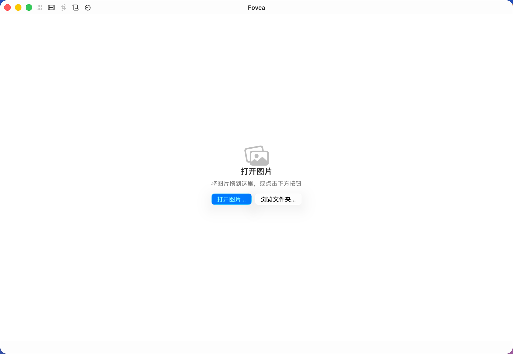
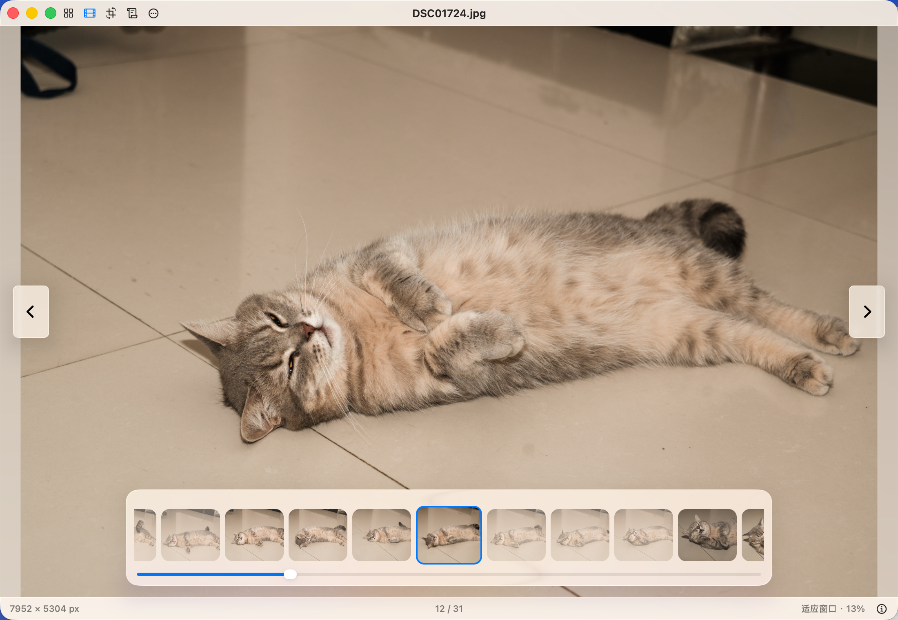

# Fovea

[English](README.md)

<p align="center">
  
</p>

Fovea 是原生 macOS 图片浏览器，围绕快速打开、同目录连续浏览和触控板操作设计。它支持常用及专业图片格式，也可以设为默认图片应用。

<p align="center">
  
</p>

<p align="center">
  
</p>

## 功能

- 支持 JPEG、PNG、GIF、TIFF、BMP、HEIC、HEIF、WebP、AVIF、SVG，以及多种 RAW 和专业图像格式。
- 从 Finder、拖放、最近项目或“打开”菜单载入图片，按自然排序浏览同一目录。
- 通过键盘、页边控制和触控板横向手势切换图片，支持缩放、平移、全屏和连续纵向浏览。
- 提供自动隐藏的胶片栏、信息面板、搜索式帮助、使用提示，以及浅色、深色和跟随系统外观。
- 提供旋转、镜像、自由裁剪、撤销和重做、保存、另存为、重命名、移到废纸篓和在 Finder 中显示。
- 文件夹浏览支持搜索、格式过滤、排序、多选、批量移动、批量重命名、可取消进度和一次撤销。

## 通过 Homebrew 安装

当前发布包面向 Apple Silicon，要求 macOS 26 或更高版本。

```bash
brew tap RainGiving/tap
brew install --cask fovea
```

更新已安装版本：

```bash
brew update
brew upgrade --cask fovea
```

也可以从 [GitHub Releases](https://github.com/RainGiving/Fovea/releases) 下载磁盘镜像。

## 从源码构建

构建需要 macOS 26 SDK 和 Swift 6.2 或更高版本。

```bash
make check
make build
open .build/Fovea.app
```

其他命令：

```bash
make test      # 运行测试
make audit     # 运行项目审计
make check     # 运行测试和审计
make dmg       # 生成 .build/artifacts/Fovea-X.Y.Z.dmg
make install   # 安装 /Applications/Fovea.app
make default-app # 把 Fovea 设成它声明的图片类型的默认打开方式
make clean     # 清理 .build
```

改完应用之后，本机上 `make install` 和 `make default-app` 两步都要走，
见[更新之后必须走的两步](docs/post-update-steps.md)。

## 发布

`CFBundleShortVersionString` 是发布版本来源，`make version` 会输出当前版本。

```bash
make release VERSION=X.Y.Z
git tag vX.Y.Z
git push origin main --follow-tags
```

GitHub Actions 会校验标签和版本，重新运行测试与审计，生成含版本号的 DMG，并发布到 GitHub Releases。

## 名称迁移

Fovea 是 ImageView 的后续名称。应用包路径为 `/Applications/Fovea.app`，Bundle Identifier 为 `io.github.raingiving.fovea`。历史设计、计划、QA 和性能文档保留 ImageView 名称，以保存原始上下文。

## 许可

[MIT License](LICENSE)
